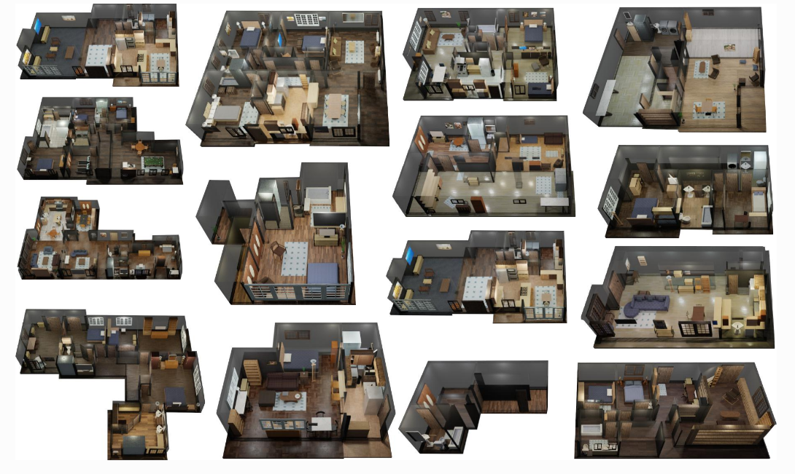
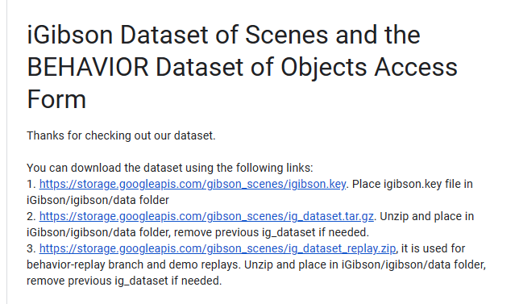

# Datasets

[toc]

## Downloading the iGibson Dataset of Scenes and the BEHAVIOR Dataset of Objects

What the dataset contains

- __iGibson 1.0 Dataset of Scenes__: We annotated fifteen 3D reconstructions of real-world scans and converted them into fully interactive scene models. In this process, we respect the original object-instance layout and object-category distribution. The object models are extended from open-source datasets (ShapeNet Dataset, Motion Dataset, SAPIEN Dataset) enriched with annotations of material and dynamic properties.
- __iGibson 2.0 Dataset of Scenes__: New versions of the fifteen fully interactive scenes, more densely populated with objects.
- __BEHAVIOR Dataset of Objects__: Dataset of object models annotated with physical and semantic properties. The 3D models are free to use within iGibson 2.0 for BEHAVIOR (due to artists’ copyright, models are encrypted and can only to be used within iGibson 2.0).

Download the datasets

